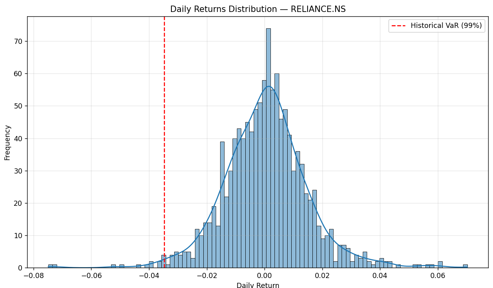
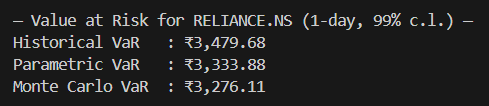

# Value at Risk (VaR) Analysis – Reliance Industries (RELIANCE.NS)

## Overview

This project estimates the **Value at Risk (VaR)** for **Reliance Industries Ltd (RELIANCE.NS)** using three widely accepted methods in financial risk management:

1. **Historical Simulation**
2. **Parametric (Variance–Covariance) Method**
3. **Monte Carlo Simulation**

The analysis helps quantify potential portfolio losses at a chosen confidence level — a key aspect of **market risk management**.


---

## What is Value at Risk (VaR)?

**Value at Risk (VaR)** is a statistical measure that estimates the **maximum potential loss** a portfolio or investment may experience over a specific time period, given normal market conditions and a defined confidence level.

In simple terms:

> “VaR answers the question — *How much can I lose, with a given probability, over a certain time horizon?*”

For example, a 99% one-day VaR of ₹5,000 means there’s a 1% chance the portfolio could lose more than ₹5,000 in a single day.

---

## Objective

The objective of this project is to:

* Estimate the **1-day Value at Risk (VaR)** of Reliance stock using three methods.
* Compare the results and understand how assumptions (normality, historical data, randomness) influence risk estimation.
* Visualize the distribution of daily returns and the corresponding VaR threshold.

---

## Methodology

### 1. Historical Simulation

* Based on actual historical returns of the stock.
* Sorts past returns and determines the percentile corresponding to the chosen confidence level.
* **No distributional assumptions** required.

### 2. Parametric (Variance–Covariance) Method

* Assumes returns are **normally distributed**.
* VaR is calculated using mean (μ), standard deviation (σ), and z-score from the normal distribution:
  [
  VaR = -(\mu + z \cdot \sigma)
  ]
* Simple and fast, but less accurate when returns deviate from normality.

### 3. Monte Carlo Simulation

* Generates thousands of simulated returns based on estimated μ and σ.
* Calculates potential portfolio losses and extracts the loss at the desired percentile.
* Flexible and powerful but computationally more intensive.

---

## Data & Parameters

| Parameter                     | Description              | Value                   |
| ----------------------------- | ------------------------ | ----------------------- |
| **Ticker**                    | Reliance Industries Ltd. | `RELIANCE.NS`           |
| **Data Source**               | Yahoo Finance            | 2021-01-01 → 2025-10-01 |
| **Portfolio Value**           | ₹100,000                 |                         |
| **Confidence Level**          | 99%                      |                         |
| **Simulations (Monte Carlo)** | 10,000                   |                         |

---

## 📈 Results (Example Output)



*(Values will vary depending on market data.)*

A distribution plot of daily returns is also generated, marking the **VaR threshold** for visual understanding.

---

## Interpretation

* A **higher VaR** implies higher potential losses (greater market risk).
* Differences between the three methods highlight:

  * Historical VaR: purely data-driven.
  * Parametric VaR: assumes normality, smoother but less realistic tails.
  * Monte Carlo VaR: flexible, can adapt to non-normal scenarios if adjusted.

---

## Recommendations

* **Use multiple methods** to cross-validate risk measures rather than relying on one.
* **Stress testing** and **Expected Shortfall (CVaR)** can complement VaR for tail-risk analysis.
* Extend analysis to **multi-asset portfolios** for broader risk management insights.
* Regularly **update data** to reflect current market conditions.

---

## Tools & Libraries

* **Python 3.10+**
* `numpy`, `pandas`, `matplotlib`, `seaborn`, `scipy`, `yfinance`

---

## File Structure

```
VaR_RELIANCE/
│
├── VaR_RELIANCE.py       # Main Python script for VaR calculation
├── README.md             # Project documentation (this file)
└── requirements.txt      # (Optional) List of dependencies
```

---

## Author

**T. Veda Vedhya**
Project Type: *Finance | Risk Analysis | Quantitative Research*

---

## License

This project is open-source under the **MIT License**. You’re free to use, modify, and distribute it with attribution.
